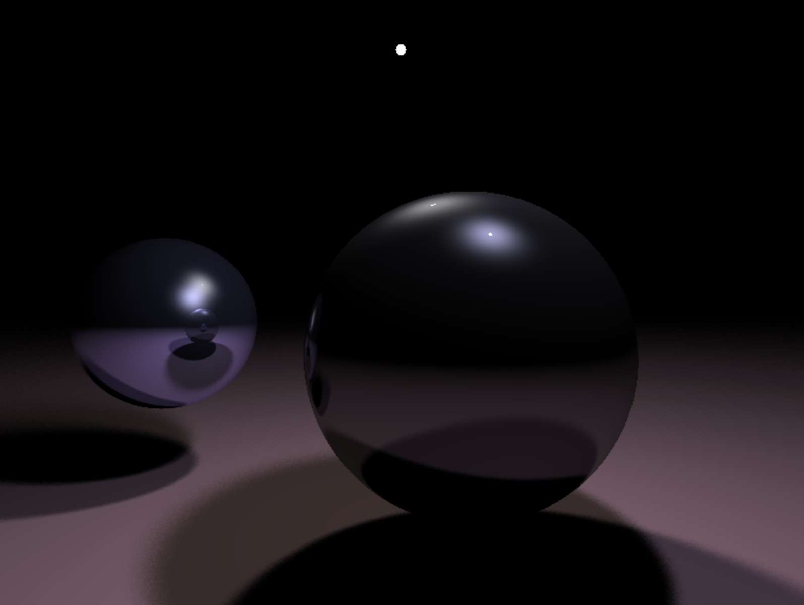

RaycastJS
=========

A minimal ray cast 3D renderer in plain JavaScript. Based on Jacco Bikker's article and code at [Flipcode](https://www.flipcode.com/archives/Raytracing_Topics_Techniques-Part_1_Introduction.shtml).

Currently implements basic Phong shading, reflections and (naive) soft shadows for spheres and planes only. The camera is a single point.

## Usage

Create a scene and a canvas and point the renderer at both.

The following recreates the first scene from Flipcode:

```
const canvas = document.createElement('canvas');
const camera = Vector3.create(0, 0, -5);
const scene = new Scene([-4, 4, -3, 3], camera, [
    new Plane(new Vector3(0, 1, 0), 4.4, new Material(new Color(0.4, 0.3, 0.3), 0, 1)),
    new Sphere(new Vector3(1, -0.8, 3), 2.5, new Material(new Color(0.7, 0.7, 0.7), 0.6)),
    new Sphere(new Vector3(-5.5, -0.5, 7), 2, new Material(new Color(0.7, 0.7, 1), 1, 0.1)),
    new Light(new Vector3(0, 5, 5), 0.1, new Material(new Color(0.6, 0.6, 0.6))),
    new Light(new Vector3(2, 5, 1), 0.1, new Material(new Color(0.7, 0.7, 0.9))),
]);
const renderer = new Renderer(scene);

canvas.width = 800;
canvas.height = 600;

renderer.render(canvas);

document.body.append(canvas);
```


